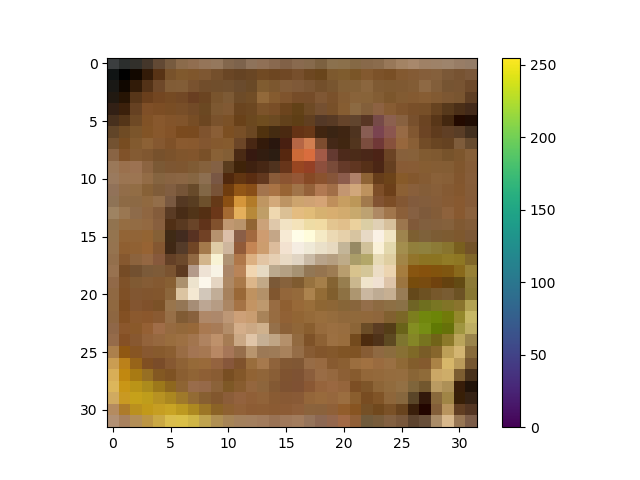
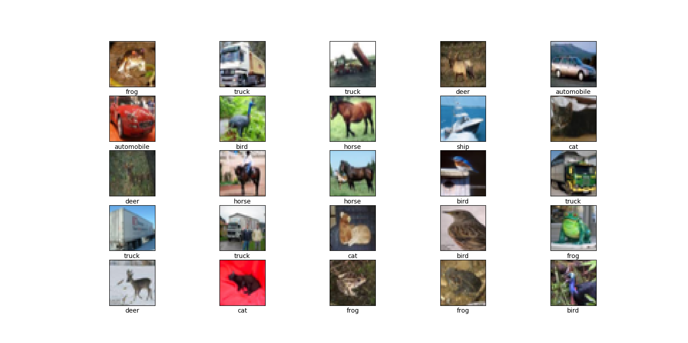
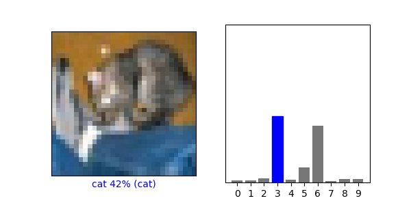
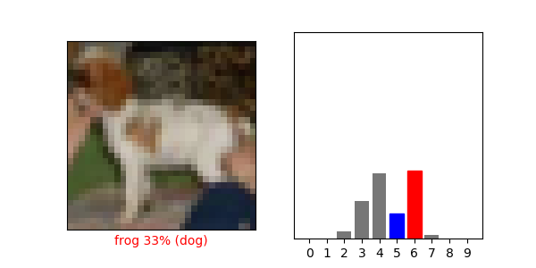
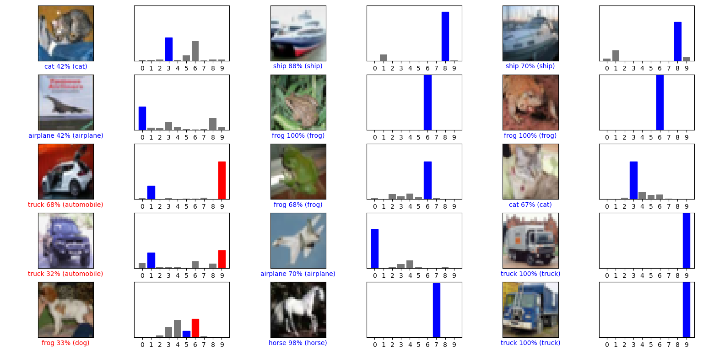

# nn-cnn-cifar10
This is CNN based number classification on the cifar10 mnist data set. This code has been taken and modified from the official keras documentation.

### Sample images of DataSet (frog)  

  

  

### Training DataSet

  

### Result after training for Cat

  

### Result after training for dog

  

### Result for all the test images

  

